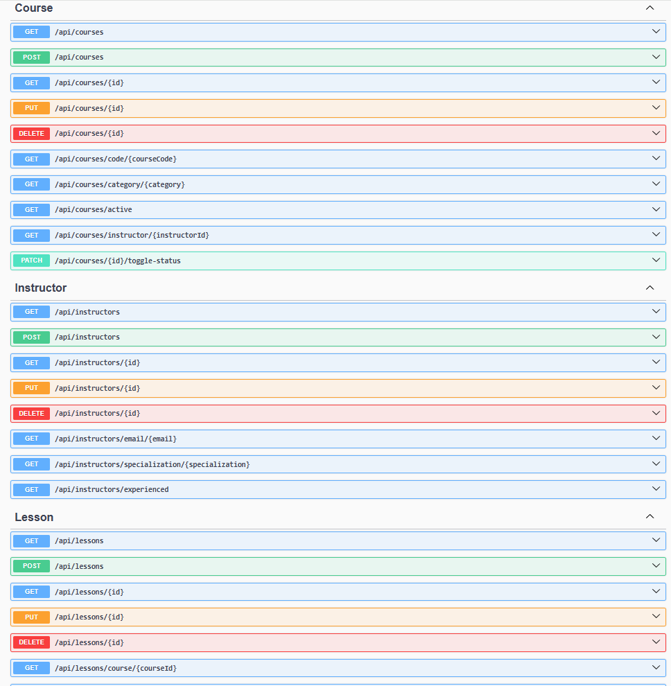

# Aviation Training Microservice (.NET 8)

## Overview
A RESTful microservice for managing aviation training courses, instructors, and lessons. Built with ASP.NET Core (.NET 8) and Entity Framework Core, this project replicates the core functionality of another Spring Boot aviation microservice I created.

## Features
- CRUD operations for Courses, Instructors, and Lessons
- Assign instructors to courses and organize lessons
- Data seeding for development (in-memory or SQL Server)
- Swagger/OpenAPI documentation
- Modern C# and .NET 8 best practices

## Project Structure
```
training_service/
|-- Controller/
|   |-- CourseController.cs
|   |-- InstructorController.cs
|   |-- LessonController.cs
|-- data/
|   |-- DataSeeder.cs
|   |-- TrainingDbContext.cs
|-- model/
|   |-- Course.cs
|   |-- Instructor.cs
|   |-- Lesson.cs
|-- repository/
|   |-- CourseRepository.cs
|   |-- InstructorRepository.cs
|   |-- LessonRepository.cs
|-- service/
|   |-- CourseService.cs
|   |-- InstructorService.cs
|   |-- LessonService.cs
|-- config/
|   |-- SecurityConfig.cs
|-- Program.cs
|-- appsettings.json
|-- appsettings.Development.json
```

## Database Schema

**Course**

| Field         | Type      | Description                |
|---------------|-----------|----------------------------|
| Id            | bigint PK | Course ID (auto-increment) |
| Title         | string    | Course title               |
| Description   | string    | Course description         |
| CourseCode    | string    | Unique course code         |
| DurationHours | int?      | Duration in hours          |
| Level         | string    | Course level               |
| Category      | string    | Course category            |
| Price         | decimal?  | Course price               |
| IsActive      | bool      | Active status              |
| CreatedAt     | datetime  | Creation timestamp         |
| UpdatedAt     | datetime  | Last update timestamp      |
| InstructorId  | bigint FK | Linked instructor          |

**Instructor**

| Field               | Type      | Description                    |
|---------------------|-----------|--------------------------------|
| Id                  | bigint PK | Instructor ID (auto-increment) |
| FirstName           | string    | First name                     |
| LastName            | string    | Last name                      |
| Email               | string    | Email (unique)                 |
| Phone               | string    | Phone number                   |
| Specialization      | string    | Area of expertise              |
| YearsOfExperience   | int       | Years of experience            |
| CertificationNumber | string    | Certification number           |
| CreatedAt           | datetime  | Creation timestamp             |
| UpdatedAt           | datetime  | Last update timestamp          |

**Lesson**

| Field           | Type      | Description                |
|-----------------|-----------|----------------------------|
| Id              | bigint PK | Lesson ID (auto-increment) |
| Title           | string    | Lesson title               |
| Description     | string    | Lesson description         |
| LessonNumber    | int       | Sequence/order             |
| DurationMinutes | int       | Duration in minutes        |
| Type            | string    | Lesson type (enum as str)  |
| Content         | string    | Lesson content             |
| IsMandatory     | bool      | Mandatory flag             |
| CreatedAt       | datetime  | Creation timestamp         |
| UpdatedAt       | datetime  | Last update timestamp      |
| CourseId        | bigint FK | Linked course              |

## Getting Started
1. Clone the repository.
2. Configure your database in `appsettings.json` or use the in-memory provider for development.
3. Run the application and access Swagger UI at `/swagger` for API testing.


# Screenshots / API Testing

## *APIs schema*  


### *POST API Course – AEL 101*  


### *POST API Instructor – Kevin Llanos*


### *GET API Courses* 
